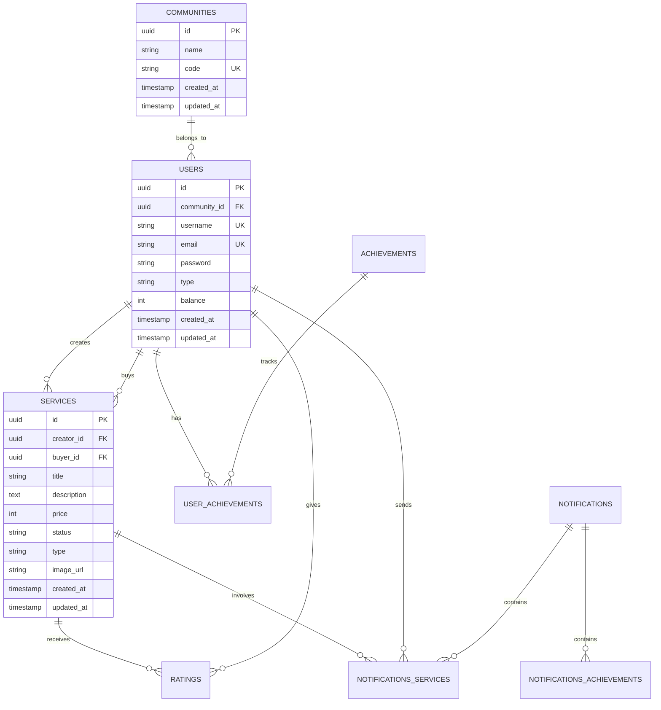
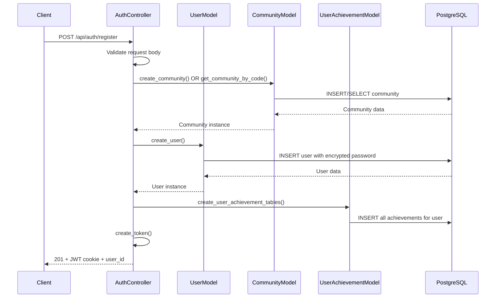
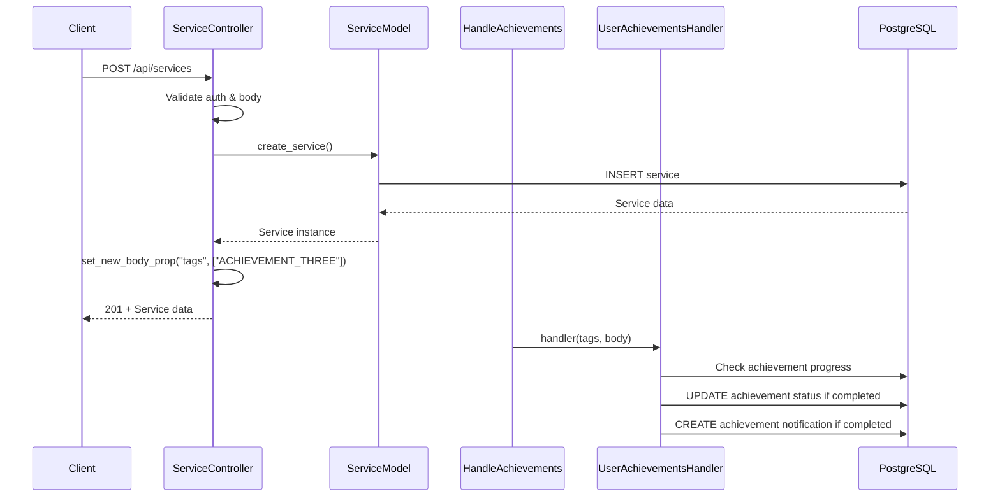
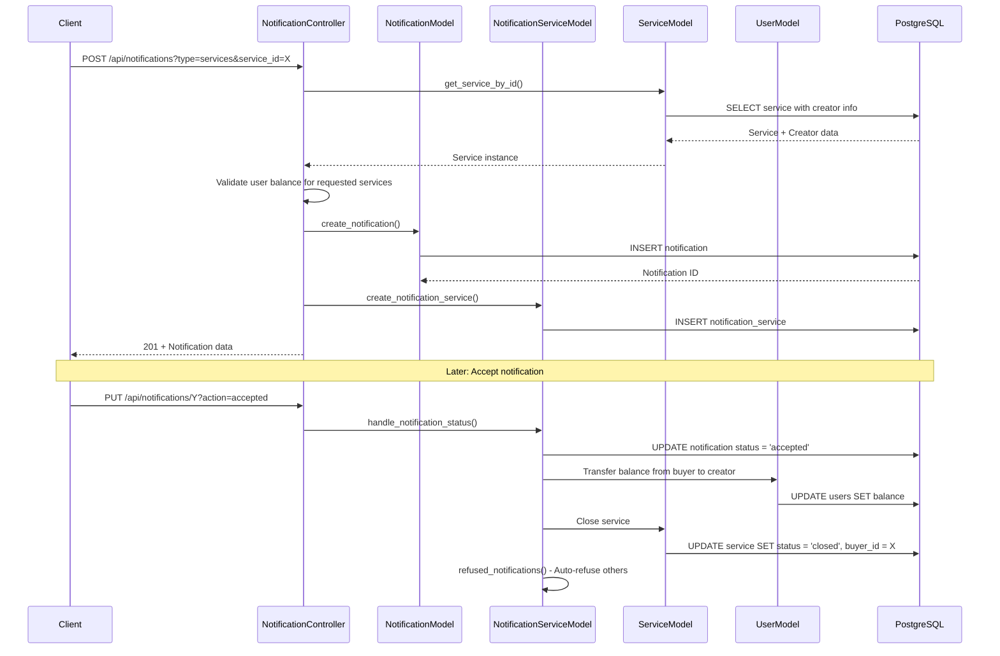

# 🏘️ Neby Backend - Community Service Platform

[](https://isocpp.org/)
[](https://crowcpp.org/)
[](https://postgresql.org/)
[](https://jwt.io/)
[](https://docker.com/)
[](https://github.com/google/googletest)

Una implementación completa de **plataforma de servicios comunitarios** en C++ usando Crow Framework, demostrando arquitectura robusta con autenticación JWT, sistema de logros gamificado, y gestión completa de servicios marketplace.

## 📋 Tabla de Contenidos

- [🎯 Introducción](#-introducción)
- [🏗️ Arquitectura del Proyecto](#️-arquitectura-del-proyecto)
- [🚀 Instalación y Configuración](#-instalación-y-configuración)
- [💾 Configuración de Base de Datos](#-configuración-de-base-de-datos)
- [📂 Estructura del Proyecto](#-estructura-del-proyecto)
- [🔧 Comandos Disponibles](#-comandos-disponibles)
- [🧪 Testing](#-testing)
- [🔐 Autenticación y Seguridad](#-autenticación-y-seguridad)
- [📡 API Endpoints](#-api-endpoints)
- [🗄️ Modelos de Datos](#️-modelos-de-datos)
- [🔄 Flujo de Datos](#-flujo-de-datos)
- [🎮 Sistema de Logros](#-sistema-de-logros)
- [🔧 Sistema de Middlewares](#-sistema-de-middlewares)
- [⚙️ Utilidades y Helpers](#️-utilidades-y-helpers)
- [🛠️ Tecnologías Utilizadas](#️-tecnologías-utilizadas)
- [📖 Ejemplos de Uso](#-ejemplos-de-uso)
- [🚀 Despliegue](#-despliegue)
- [🤝 Contribución](#-contribución)

---

## 🎯 Introducción

Neby Backend es una plataforma robusta de servicios comunitarios desarrollada en C++ que permite a los usuarios de una comunidad intercambiar servicios, gestionar un sistema de moneda virtual, obtener logros gamificados, y administrar notificaciones en tiempo real.

### ¿Por qué esta Arquitectura?

- ✅ **Performance**: C++ ofrece rendimiento superior para operaciones críticas
- ✅ **Escalabilidad**: Arquitectura modular con connection pooling
- ✅ **Seguridad**: Autenticación JWT robusta con validación multicapa
- ✅ **Mantenibilidad**: Separación clara de responsabilidades (MVC-like)
- ✅ **Testabilidad**: Suite completa de tests de integración
- ✅ **Gamificación**: Sistema de logros integrado para engagement

### Características Principales

- 🏘️ **Gestión de Comunidades**: Múltiples comunidades aisladas con códigos de acceso
- 💱 **Marketplace de Servicios**: Ofertas y solicitudes con sistema de moneda virtual
- 🎯 **Sistema de Logros**: 5 logros gamificados con recompensas automáticas
- 📨 **Sistema de Notificaciones**: Workflow completo de notificaciones de servicios
- ⭐ **Sistema de Ratings**: Reputación basada en transacciones completadas
- 👑 **Roles Diferenciados**: Administradores y vecinos con permisos específicos

---

## 🏗️ Arquitectura del Proyecto

### Principios Arquitectónicos

El proyecto sigue una arquitectura **MVC-like** con separación clara de responsabilidades:

```bash
┌─────────────────────────────────┐
│    CAPA DE PRESENTACIÓN         │  ← Routes, Controllers, Middlewares
│      (Crow Framework)           │
└─────────────┬───────────────────┘
              ↓ (usa)
┌─────────────────────────────────┐
│     CAPA DE APLICACIÓN          │  ← Business Logic, Validation
│     (Controllers & Utils)       │
└─────────────┬───────────────────┘
              ↓ (accede)
┌─────────────────────────────────┐
│   CAPA DE PERSISTENCIA          │  ← Models, Database Access
│    (PostgreSQL + PQXX)          │
└─────────────────────────────────┘
```

### Componentes Principales

- **Crow Framework**: Web server y routing HTTP
- **Connection Pool**: Gestión eficiente de conexiones PostgreSQL
- **JWT Middleware**: Autenticación stateless
- **Achievement System**: Sistema gamificado con middleware dedicado
- **Validation Layer**: Validación robusta de entrada con regex

---

## 🚀 Instalación y Configuración

### Prerrequisitos

- [GCC](https://gcc.gnu.org/) (compatible con C++20)
- [CMake](https://cmake.org/) (versión 3.18 o superior)
- [PostgreSQL](https://postgresql.org/) (versión 12 o superior)
- [Docker](https://docker.com/) (recomendado para desarrollo)
- [Git](https://git-scm.com/)

### Dependencias del Sistema

#### Ubuntu/Debian
```bash
sudo apt-get update
sudo apt-get install -y \
    libpqxx-dev \
    libboost-dev \
    cmake \
    inotify-tools \
    git \
    nlohmann-json3-dev \
    libgtest-dev \
    libssl-dev
```

#### Dependencias Compiladas
```bash
# BCrypt Library
git clone https://github.com/trusch/libbcrypt.git
cd libbcrypt && mkdir build && cd build
cmake .. && make && sudo make install && sudo ldconfig

# JWT-CPP (manejado por CMake FetchContent)
# CPR Library (para testing)
```

### Instalación

```bash
# Clonar el repositorio
git clone <repository-url>
cd neby/backend

# Configurar variables de entorno
cp .env.example .env
```

### Variables de Entorno

Configura el archivo `.env`:

```env
# Database Configuration
DB_NAME=neby_db
DB_USER=neby_user
DB_PASSWORD=secure_password
DB_HOST=localhost
DB_PORT=5432

# Server Configuration
HTTP_PORT=8080

# JWT Configuration
SECRET_JWT=your-ultra-secure-jwt-secret-key-here

# Environment
NODE_ENV=development
```

---

## 💾 Configuración de Base de Datos

### Usando Docker (Recomendado)

```bash
# Crear red Docker
docker network create neby-network

# PostgreSQL Container
docker run -d \
  --name neby-postgres \
  --network neby-network \
  -e POSTGRES_DB=neby_db \
  -e POSTGRES_USER=neby_user \
  -e POSTGRES_PASSWORD=secure_password \
  -p 5432:5432 \
  postgres:15
```

### Esquema de Base de Datos

#### Tablas Principales

```sql
-- Comunidades
CREATE TABLE communities (
    id UUID PRIMARY KEY DEFAULT gen_random_uuid(),
    name VARCHAR(255) NOT NULL,
    code VARCHAR(8) UNIQUE NOT NULL,
    created_at TIMESTAMP DEFAULT CURRENT_TIMESTAMP,
    updated_at TIMESTAMP DEFAULT CURRENT_TIMESTAMP
);

-- Usuarios
CREATE TABLE users (
    id UUID PRIMARY KEY DEFAULT gen_random_uuid(),
    community_id UUID REFERENCES communities(id),
    username VARCHAR(30) UNIQUE NOT NULL,
    email VARCHAR(255) UNIQUE NOT NULL,
    password VARCHAR(255) NOT NULL,
    type VARCHAR(10) CHECK (type IN ('admin', 'neighbor')),
    balance INTEGER DEFAULT 50,
    created_at TIMESTAMP DEFAULT CURRENT_TIMESTAMP,
    updated_at TIMESTAMP DEFAULT CURRENT_TIMESTAMP
);

-- Servicios
CREATE TABLE services (
    id UUID PRIMARY KEY DEFAULT gen_random_uuid(),
    creator_id UUID REFERENCES users(id),
    buyer_id UUID REFERENCES users(id),
    title VARCHAR(255) NOT NULL,
    description TEXT,
    price INTEGER NOT NULL CHECK (price >= 0),
    status VARCHAR(10) CHECK (status IN ('open', 'closed')),
    type VARCHAR(10) CHECK (type IN ('offered', 'requested')),
    image_url VARCHAR(500),
    created_at TIMESTAMP DEFAULT CURRENT_TIMESTAMP,
    updated_at TIMESTAMP DEFAULT CURRENT_TIMESTAMP
);

-- Logros predefinidos
CREATE TABLE achievements (
    title VARCHAR(255) PRIMARY KEY,
    description TEXT NOT NULL,
    reward INTEGER NOT NULL
);

-- Progreso de logros por usuario
CREATE TABLE user_achievements (
    id UUID PRIMARY KEY DEFAULT gen_random_uuid(),
    user_id UUID REFERENCES users(id),
    achievement_title VARCHAR(255) REFERENCES achievements(title),
    status VARCHAR(20) CHECK (status IN ('in_progress', 'completed', 'claimed')),
    UNIQUE(user_id, achievement_title)
);

-- Sistema de notificaciones
CREATE TABLE notifications (
    id UUID PRIMARY KEY DEFAULT gen_random_uuid(),
    type VARCHAR(20) CHECK (type IN ('services', 'achievements', 'reviews')),
    created_at TIMESTAMP DEFAULT CURRENT_TIMESTAMP,
    updated_at TIMESTAMP DEFAULT CURRENT_TIMESTAMP
);

-- Notificaciones de servicios
CREATE TABLE notifications_services (
    id UUID PRIMARY KEY DEFAULT gen_random_uuid(),
    notification_id UUID REFERENCES notifications(id),
    sender_id UUID REFERENCES users(id),
    service_id UUID REFERENCES services(id),
    status VARCHAR(10) CHECK (status IN ('pending', 'accepted', 'refused'))
);

-- Ratings
CREATE TABLE ratings (
    id UUID PRIMARY KEY DEFAULT gen_random_uuid(),
    service_id UUID REFERENCES services(id),
    sender_id UUID REFERENCES users(id),
    rating INTEGER CHECK (rating >= 1 AND rating <= 5),
    description TEXT
);
```

---

## 📂 Estructura del Proyecto

```bash
backend/
├── CMakeLists.txt                   # Configuración principal de CMake
├── hot-reload.sh                    # Script de desarrollo con recarga automática
├── Dockerfile.dev                   # Contenedor de desarrollo
├── Dockerfile.prod                  # Contenedor de producción
├── Dockerfile.test                  # Contenedor de testing
├── crow-v1.0+5.deb                 # Paquete Crow personalizado
├── src/                             # 🎭 CAPA DE IMPLEMENTACIÓN
│   ├── main.cpp                     # Punto de entrada de la aplicación
│   ├── controllers/                 # Controladores de endpoints
│   │   ├── auth_controller.cpp      # Autenticación y registro
│   │   ├── user_controller.cpp      # Gestión de usuarios
│   │   ├── service_controller.cpp   # Marketplace de servicios
│   │   ├── rating_controller.cpp    # Sistema de valoraciones
│   │   ├── notification_controller.cpp # Sistema de notificaciones
│   │   └── user_achievement_controller.cpp # Sistema de logros
│   ├── models/                      # 🗄️ CAPA DE DATOS
│   │   ├── user_model.cpp           # Modelo de usuario
│   │   ├── community_model.cpp      # Modelo de comunidad
│   │   ├── service_model.cpp        # Modelo de servicio
│   │   ├── rating_model.cpp         # Modelo de rating
│   │   ├── achievement_model.cpp    # Modelo de logros
│   │   ├── notification_model.cpp   # Sistema de notificaciones
│   │   ├── notification_service_model.cpp
│   │   ├── user_achievement_model.cpp
│   │   └── achievement_notification_model.cpp
│   ├── routes/                      # 🛣️ DEFINICIÓN DE RUTAS
│   │   ├── auth_routes.cpp          # Rutas de autenticación
│   │   ├── user_routes.cpp          # Rutas de usuarios
│   │   ├── service_routes.cpp       # Rutas de servicios
│   │   ├── rating_routes.cpp        # Rutas de ratings
│   │   ├── notification_routes.cpp  # Rutas de notificaciones
│   │   └── user_achievement_routes.cpp # Rutas de logros
│   ├── middlewares/                 # 🔧 CAPA DE MIDDLEWARE
│   │   ├── verify_jwt.cpp           # Middleware de autenticación JWT
│   │   └── handle_achievements.cpp  # Middleware de sistema de logros
│   ├── utils/                       # ⚙️ UTILIDADES
│   │   ├── auth.cpp                 # Utilidades de autenticación
│   │   ├── validations.cpp          # Validaciones generales
│   │   ├── user_validations.cpp     # Validaciones específicas de usuario
│   │   ├── custom_regex.cpp         # Patrones regex personalizados
│   │   ├── errors.cpp               # Excepciones personalizadas
│   │   ├── utils.cpp                # Utilidades generales
│   │   ├── common.cpp               # Constantes y configuración
│   │   └── user_achievements_handler.cpp # Lógica de logros
│   └── db/                          # 🔌 CAPA DE CONEXIÓN
│       ├── conncection_pool.cpp     # Pool de conexiones PostgreSQL
│       └── utils.cpp                # Utilidades de base de datos
├── include/                         # 📋 HEADERS
│   ├── controllers/                 # Headers de controladores
│   ├── models/                      # Headers de modelos
│   ├── routes/                      # Headers de rutas
│   ├── middlewares/                 # Headers de middlewares
│   ├── utils/                       # Headers de utilidades
│   └── db/                          # Headers de base de datos
└── test/                            # 🧪 SUITE DE TESTING
    ├── CMakeLists.txt               # Configuración de tests
    ├── TEST_README.md               # Documentación de testing
    └── tests/
        ├── main.cpp                 # Runner principal de tests
        ├── common.h/.cpp            # Utilidades compartidas de testing
        ├── auth/                    # Tests de autenticación
        │   ├── login_test.cpp
        │   └── register_test.cpp
        ├── services/                # Tests de servicios
        │   ├── create_service_test.cpp
        │   ├── get_all_services_test.cpp
        │   ├── get_service_test.cpp
        │   ├── get_services_self_test.cpp
        │   ├── update_service_test.cpp
        │   └── delete_service_test.cpp
        ├── ratings/                 # Tests de ratings
        │   ├── create_rating_test.cpp
        │   ├── get_service_rating_test.cpp
        │   └── get_user_ratings_test.cpp
        └── users/                   # Tests de usuarios
            ├── delete_user_test.cpp
            └── update_user_admin_test.cpp
```

---

## 🔧 Comandos Disponibles

### Desarrollo Local

```bash
# Compilar aplicación principal
cmake .
make

# Ejecutar servidor
./backend

# Desarrollo con hot reload
chmod +x hot-reload.sh
./hot-reload.sh ./backend
```

### Testing

```bash
# Compilar tests
cd test
cmake .
make

# Ejecutar todos los tests
./test

# Ejecutar suite específica
./test --gtest_filter="AuthTest*"
./test --gtest_filter="ServiceTest*"
./test --gtest_filter="RatingTest*"

# Ejecutar test específico
./test --gtest_filter="AuthTest.RegisterValidEmail"
./test --gtest_filter="ServiceTest.CreateServiceSuccess"
```

### Docker para Desarrollo

```bash
# Desarrollo con hot reload
docker build -f Dockerfile.dev -t neby-backend-dev .
docker run -v $(pwd):/app -p 8080:8080 neby-backend-dev

# Testing environment
docker build -f Dockerfile.test -t neby-backend-test .
docker run neby-backend-test

# Producción
docker build -f Dockerfile.prod -t neby-backend-prod .
docker run -p 8080:8080 neby-backend-prod
```

### Debugging y Desarrollo

```bash
# Linting (usando clang-tidy si está disponible)
find src/ -name "*.cpp" -exec clang-tidy {} \;

# Formateo (usando clang-format si está disponible)
find src/ include/ -name "*.cpp" -o -name "*.h" | xargs clang-format -i

# Análisis de memoria (con valgrind)
valgrind --leak-check=full ./backend

# Profiling (con gprof)
g++ -pg -o backend src/*.cpp
./backend
gprof backend gmon.out > profile.txt
```

---

## 🧪 Testing

### Estrategia de Testing

El proyecto implementa **Integration Testing** completo usando Google Test y CPR para validar todos los endpoints de la API.

#### Framework de Testing

- **Google Test**: Framework principal de testing en C++
- **CPR**: Cliente HTTP para realizar requests a los endpoints
- **nlohmann/json**: Manipulación de datos JSON en tests
- **PostgreSQL**: Base de datos de testing

#### Organización de Tests

```bash
tests/
├── auth/                    # Tests de autenticación
│   ├── login_test.cpp       # Validación de login
│   └── register_test.cpp    # Validación de registro
├── services/                # Tests de marketplace
│   ├── create_service_test.cpp
│   ├── get_all_services_test.cpp
│   ├── get_service_test.cpp
│   ├── get_services_self_test.cpp
│   ├── update_service_test.cpp
│   └── delete_service_test.cpp
├── ratings/                 # Tests de sistema de ratings
│   ├── create_rating_test.cpp
│   ├── get_service_rating_test.cpp
│   └── get_user_ratings_test.cpp
├── users/                   # Tests de gestión de usuarios
│   ├── delete_user_test.cpp
│   └── update_user_admin_test.cpp
└── common.h/.cpp           # Utilidades compartidas
```

#### Ejemplo de Test de Integración

```cpp
#include <gtest/gtest.h>
#include <cpr/cpr.h>
#include <nlohmann/json.hpp>
#include "../common.h"

class RegisterValidations : public ::testing::Test {
protected:
    void SetUp() override {
        clean_user_table();
        clean_community_table();
    }
    
    void TearDown() override {
        clean_user_table();
        clean_community_table();
    }
};

TEST_F(RegisterValidations, correct_email) {
    std::string url = "http://backend:" + std::to_string(HTTP_PORT) + "/api/auth/register";
    
    std::vector<std::string> correct_emails = {
        "user@example.com",
        "user123@example.com", 
        "user.name@example.com"
    };
    
    for (const auto& email : correct_emails) {
        nlohmann::json post_data = {
            {"email", email},
            {"password", "F!sh1ngR0ck5"},
            {"type", "admin"},
            {"username", "example"},
            {"community_name", "example_community_name"}
        };
        
        auto response = cpr::Post(
            cpr::Url{url}, 
            cpr::Body{post_data.dump()}, 
            cpr::Header{{"Content-Type", "application/json"}}
        );
        
        EXPECT_EQ(response.status_code, 201);
        clean_community_table();
        clean_user_table();
    }
}
```

#### Ejecución con Docker

```bash
# Método 1: Ejecución automatizada
docker compose -f test.yml up --build

# Método 2: Ejecución manual
docker exec -it test bash
cd test
./test --gtest_filter="specific_test"
```

### Cobertura de Testing

- ✅ **Validación de Entrada**: Emails, passwords, usernames
- ✅ **Autenticación**: JWT tokens, login/logout flow
- ✅ **Autorización**: Permisos de admin vs vecino
- ✅ **Business Logic**: Marketplace de servicios, ratings
- ✅ **Error Handling**: Respuestas de error apropiadas
- ✅ **Database Operations**: CRUD operations
- ✅ **Integration Flow**: Workflows completos end-to-end

---

## 🔐 Autenticación y Seguridad

### Sistema de Autenticación JWT

#### Flujo de Autenticación

1. **Registro/Login**: Usuario envía credenciales
2. **Validación**: Server valida datos y genera JWT
3. **Token Storage**: JWT se almacena en cookie HTTP-only
4. **Request Authorization**: Middleware valida JWT en cada request
5. **User Context**: Información de usuario se inyecta en request

#### Configuración JWT

```cpp
// Creación de token
std::string create_token(std::unique_ptr<UserModel>& user) {
    auto token = jwt::create()
        .set_type("JWS")
        .set_issuer("auth0")
        .set_payload_claim("id", jwt::claim(std::string(user.get()->get_id())))
        .set_expires_at(std::chrono::system_clock::now() + std::chrono::hours{1})
        .sign(jwt::algorithm::hs256{SECRET_JWT});
    return token;
}

// Validación de token
bool validate_token(const std::string& token) {
    try {
        auto verifier = jwt::verify()
            .allow_algorithm(jwt::algorithm::hs256{SECRET_JWT})
            .with_issuer("auth0");
        
        verifier.verify(jwt::decode(token));
        return true;
    } catch (const std::exception& e) {
        return false;
    }
}
```

### Características de Seguridad

#### 🔐 Password Security
- **BCrypt Hashing**: Encriptación segura de contraseñas
- **Salt Rounds**: Configurable para balance seguridad/performance
- **Password Strength**: Validación de complejidad obligatoria

```cpp
// Requisitos de password
- Mínimo 8 caracteres
- Al menos 1 letra minúscula
- Al menos 1 letra mayúscula  
- Al menos 1 número
- Al menos 1 símbolo especial
- Al menos 8 caracteres únicos
```

#### 🛡️ Input Validation
- **Email Validation**: Regex pattern robusta
- **UUID Validation**: Formato estricto para IDs
- **Field Validation**: Validación de campos requeridos
- **Type Validation**: Enums y tipos restringidos

#### 🚫 Security Headers
- **CORS Configuration**: Control de acceso cross-origin
- **Rate Limiting**: (Implementable a nivel de proxy)
- **SQL Injection Prevention**: Queries parametrizadas
- **XSS Prevention**: Sanitización de entrada

#### 🔒 Authorization Levels

```cpp
// Niveles de acceso
enum class AccessLevel {
    PUBLIC,           // Sin autenticación
    AUTHENTICATED,    // JWT válido requerido
    ADMIN_ONLY,       // Solo administradores
    OWNER_OR_ADMIN,   // Propietario del recurso o admin
    SAME_COMMUNITY    // Misma comunidad solamente
};
```

---

## 📡 API Endpoints

### Base URL: `/api`

### 🔐 Autenticación

#### POST `/api/auth/register` - Registro de Usuario
```http
POST /api/auth/register
Content-Type: application/json

{
  "username": "john_doe",
  "email": "john@example.com", 
  "password": "SecureP@ss123",
  "type": "admin",                    // "admin" | "neighbor"
  "community_name": "Oakwood Hills",  // Requerido para admin
  "community_code": "ABCD1234"       // Requerido para neighbor
}

Response 201:
{
  "id": "550e8400-e29b-41d4-a716-446655440000"
}
```

#### POST `/api/auth/login` - Inicio de Sesión
```http
POST /api/auth/login
Content-Type: application/json

{
  "email": "john@example.com",
  "password": "SecureP@ss123"
}

Response 200:
{
  "id": "550e8400-e29b-41d4-a716-446655440000"
}
```

#### GET `/api/auth/self` - Información del Usuario Actual
```http
GET /api/auth/self
Cookie: token=eyJhbGciOiJIUzI1NiIsInR5cCI6IkpXVCJ9...

Response 200:
{
  "id": "550e8400-e29b-41d4-a716-446655440000",
  "username": "john_doe",
  "email": "john@example.com",
  "type": "admin",
  "balance": 150,
  "community": {
    "id": "550e8400-e29b-41d4-a716-446655440001",
    "name": "Oakwood Hills",
    "code": "ABCD1234",
    "created_at": "2024-01-15T10:30:00Z"
  },
  "created_at": "2024-01-15T10:30:00Z",
  "updated_at": "2024-01-15T10:30:00Z"
}
```

### 👥 Gestión de Usuarios

#### GET `/api/users` - Lista de Usuarios (Admin)
```http
GET /api/users
Cookie: token=admin_jwt_token

Response 200:
{
  "users": [
    {
      "id": "550e8400-e29b-41d4-a716-446655440000",
      "username": "john_doe",
      "email": "john@example.com",
      "type": "admin", 
      "balance": 150,
      "created_at": "2024-01-15T10:30:00Z",
      "updated_at": "2024-01-15T10:30:00Z"
    }
  ]
}
```

#### GET `/api/users/{user_id}` - Usuario Específico
#### PUT `/api/users/self` - Actualizar Perfil Propio
#### PUT `/api/users/{user_id}` - Actualizar Usuario (Admin)
#### DELETE `/api/users/self` - Eliminar Cuenta Propia
#### DELETE `/api/users/{user_id}` - Eliminar Usuario (Admin)

### 🛍️ Marketplace de Servicios

#### GET `/api/services` - Lista de Servicios
```http
GET /api/services?status=open
Cookie: token=user_jwt_token

Response 200:
{
  "services": [
    {
      "id": "550e8400-e29b-41d4-a716-446655440002",
      "title": "Lawn Mowing Service",
      "description": "Professional lawn care with eco-friendly equipment",
      "price": 25,
      "status": "open",
      "type": "offered",
      "image_url": "https://example.com/lawn_service.jpg",
      "creator": {
        "id": "550e8400-e29b-41d4-a716-446655440000",
        "username": "john_doe",
        "email": "john@example.com",
        "type": "neighbor",
        "balance": 150
      },
      "buyer_id": null,
      "buyer": null,
      "created_at": "2024-01-15T11:00:00Z",
      "updated_at": "2024-01-15T11:00:00Z"
    }
  ]
}
```

#### POST `/api/services` - Crear Servicio
```http
POST /api/services
Cookie: token=user_jwt_token
Content-Type: application/json

{
  "title": "Dog Walking Service",
  "description": "Reliable and caring dog walking for busy pet owners",
  "price": 15,
  "type": "offered"         // "offered" | "requested"
}

Response 201:
{
  "id": "550e8400-e29b-41d4-a716-446655440003",
  "creator_id": "550e8400-e29b-41d4-a716-446655440000",
  "title": "Dog Walking Service",
  "description": "Reliable and caring dog walking for busy pet owners",
  "price": 15,
  "status": "open",
  "type": "offered",
  "image_url": null,
  "buyer_id": null,
  "created_at": "2024-01-15T12:00:00Z",
  "updated_at": "2024-01-15T12:00:00Z"
}
```

#### GET `/api/services/self` - Mis Servicios
#### GET `/api/services/{service_id}` - Servicio Específico
#### GET `/api/services/user/{user_id}` - Servicios por Usuario
#### PUT `/api/services/{service_id}` - Actualizar Servicio
#### DELETE `/api/services/{service_id}` - Eliminar Servicio

### ⭐ Sistema de Ratings

#### POST `/api/ratings/{service_id}` - Crear Rating
```http
POST /api/ratings/550e8400-e29b-41d4-a716-446655440002
Cookie: token=user_jwt_token
Content-Type: application/json

{
  "rating": 5,
  "description": "Excellent service! Very professional and timely."
}

Response 201:
{
  "id": "550e8400-e29b-41d4-a716-446655440004",
  "service_id": "550e8400-e29b-41d4-a716-446655440002",
  "rating": 5,
  "description": "Excellent service! Very professional and timely."
}
```

#### GET `/api/ratings/user/{user_id}` - Ratings de Usuario
#### GET `/api/ratings/service/{service_id}` - Rating de Servicio

### 📨 Sistema de Notificaciones

#### GET `/api/notifications` - Mis Notificaciones
```http
GET /api/notifications
Cookie: token=user_jwt_token

Response 200:
{
  "notifications": [
    {
      "id": "550e8400-e29b-41d4-a716-446655440005",
      "type": "services",
      "service": {
        "id": "550e8400-e29b-41d4-a716-446655440002",
        "title": "Lawn Mowing Service",
        "price": 25,
        "creator": {
          "username": "john_doe"
        }
      },
      "sender": {
        "username": "jane_smith"
      },
      "status": "pending",
      "created_at": "2024-01-15T13:00:00Z"
    }
  ]
}
```

#### POST `/api/notifications` - Crear Notificación
#### PUT `/api/notifications/{notification_id}` - Manejar Notificación
#### GET `/api/services/{service_id}/notifications` - Notificaciones de Servicio

### 🎮 Sistema de Logros

#### GET `/api/user_achievements` - Mis Logros
```http
GET /api/user_achievements
Cookie: token=user_jwt_token

Response 200:
{
  "user_achievements": [
    {
      "id": "550e8400-e29b-41d4-a716-446655440006",
      "user_id": "550e8400-e29b-41d4-a716-446655440000",
      "status": "completed",
      "achievement": {
        "title": "Neighborhood Pioneer: Initiate 1 Service Exchange",
        "description": "Create your first service to get started in the community marketplace",
        "reward": 10
      }
    }
  ]
}
```

#### PUT `/api/claim_achievement/{achievement_id}` - Reclamar Logro

---

## 🗄️ Modelos de Datos

### Modelo de Usuario (UserModel)

```cpp
class UserModel {
private:
    std::string _id;
    std::string _community_id;
    std::string _username;
    std::string _email;
    std::string _type;           // "admin" | "neighbor"
    int _balance;
    std::string _created_at;
    std::string _updated_at;
    std::optional<CommunityModel> _community;

public:
    // CRUD Operations
    static std::unique_ptr<UserModel> create_user(pqxx::connection& conn, 
                                                   const crow::json::rvalue& body);
    static std::unique_ptr<UserModel> get_user_by_id(pqxx::connection& conn, 
                                                      const std::string& id);
    static crow::json::wvalue get_users_admin(pqxx::connection& conn, 
                                               const std::string& community_id);
    static void update_user_by_id(pqxx::connection& conn, 
                                   const std::string& id, 
                                   const std::map<std::string, std::string>& fields);
    static void delete_user_by_id(pqxx::connection& conn, 
                                   const std::string& id);
    
    // Validation & Utilities
    static bool exists_id(pqxx::connection& conn, const std::string& id);
    static bool exists_username(pqxx::connection& conn, const std::string& username);
    static bool exists_email(pqxx::connection& conn, const std::string& email);
};
```

### Modelo de Servicio (ServiceModel)

```cpp
class ServiceModel {
private:
    std::string _id;
    std::string _creator_id;
    std::optional<std::string> _buyer_id;
    std::string _title;
    std::string _description;
    int _price;
    std::string _status;         // "open" | "closed"
    std::string _type;           // "offered" | "requested"
    std::optional<std::string> _image_url;
    std::optional<UserModel> _creator;
    std::optional<UserModel> _buyer;
    std::string _created_at;
    std::string _updated_at;

public:
    // CRUD Operations con JOINs complejas
    static crow::json::wvalue create_service(pqxx::connection& conn, 
                                              const crow::json::rvalue& body);
    static crow::json::wvalue get_services(pqxx::connection& conn, 
                                           const std::string& community_id, 
                                           const std::string& status = "");
    static std::unique_ptr<ServiceModel> get_service_by_id(pqxx::connection& conn, 
                                                            const std::string& id);
    static crow::json::wvalue get_services_sold_by_creator_id(pqxx::connection& conn, 
                                                               const std::string& creator_id);
};
```

### Modelo de Comunidad (CommunityModel)

```cpp
class CommunityModel {
private:
    std::string _id;
    std::string _name;
    std::string _code;           // 8-character access code
    std::string _created_at;
    std::string _updated_at;

public:
    // Business Logic para códigos de comunidad
    static std::unique_ptr<CommunityModel> create_community(pqxx::connection& conn, 
                                                             const std::string& name);
    static std::unique_ptr<CommunityModel> get_community_by_code(pqxx::connection& conn, 
                                                                  const std::string& code);
    
private:
    static std::string generate_community_code(const std::string& name);
};
```

### Modelo de Logros (AchievementModel)

```cpp
class AchievementModel {
private:
    std::string _title;
    std::string _description;
    int _reward;

public:
    // Logros predefinidos del sistema
    static const std::vector<std::string> ACHIEVEMENT_TITLES;
    static std::unique_ptr<AchievementModel> get_achievement_by_title(
        pqxx::connection& conn, const std::string& title);
};

// Logros disponibles:
const std::vector<std::string> AchievementModel::ACHIEVEMENT_TITLES = {
    "Service Showcase: Unveiling 5 Offerings to the World!",      // 5 servicios ofrecidos
    "Service Spectrum: Fulfilling 5 Requested Offerings!",        // 5 servicios solicitados
    "Neighborhood Pioneer: Initiate 1 Service Exchange",          // 1 servicio creado
    "Neighbor Nexus: Welcome 5 Service Offers with Open Arms",    // 5 servicios vendidos
    "Community Cohesion: Engage in 5 Vibrant Service Interactions" // 5 notificaciones aceptadas
};
```

### Relaciones de Base de Datos



---

## 🔄 Flujo de Datos

### Flujo de Registro de Usuario



### Flujo de Creación de Servicio con Logros



### Flujo de Notificación de Servicio



---

## 🎮 Sistema de Logros

### Arquitectura del Sistema de Logros

El sistema de logros está implementado como un **middleware post-procesamiento** que se ejecuta después de completar las acciones principales, permitiendo un seguimiento automático del progreso sin impactar el rendimiento de la respuesta.

#### Logros Disponibles

```cpp
struct Achievement {
    std::string title;
    std::string description;
    int reward;
    std::function<bool(std::string)> completion_check;
};

const std::vector<Achievement> AVAILABLE_ACHIEVEMENTS = {
    {
        "Service Showcase: Unveiling 5 Offerings to the World!",
        "Create 5 services of type 'offered'",
        25,  // 25 monedas virtuales
        [](std::string user_id) { return count_offered_services(user_id) >= 5; }
    },
    {
        "Service Spectrum: Fulfilling 5 Requested Offerings!", 
        "Create 5 services of type 'requested'",
        25,
        [](std::string user_id) { return count_requested_services(user_id) >= 5; }
    },
    {
        "Neighborhood Pioneer: Initiate 1 Service Exchange",
        "Create your first service",
        10,
        [](std::string user_id) { return count_total_services(user_id) >= 1; }
    },
    {
        "Neighbor Nexus: Welcome 5 Service Offers with Open Arms",
        "Have 5 of your services sold/accepted",
        30,
        [](std::string user_id) { return count_sold_services(user_id) >= 5; }
    },
    {
        "Community Cohesion: Engage in 5 Vibrant Service Interactions",
        "Accept 5 service notifications from others",
        20,
        [](std::string user_id) { return count_accepted_notifications(user_id) >= 5; }
    }
};
```

#### Middleware de Logros (HandleAchievements)

```cpp
class HandleAchievements {
public:
    struct context {};
    
    void before_handle(crow::request& req, crow::response& res, context& ctx) {
        // No pre-processing needed
    }
    
    void after_handle(crow::request& req, crow::response& res, context& ctx) {
        try {
            auto body = crow::json::load(req.body);
            if (body && body.has("tags")) {
                std::vector<std::string> tags;
                for (const auto& tag : body["tags"]) {
                    tags.push_back(tag.s());
                }
                UserAchievementsHandler::handler(tags, body);
            }
        } catch (const std::exception& e) {
            // Log error but don't affect response
            std::cerr << "Achievement processing error: " << e.what() << std::endl;
        }
    }
};
```

#### Handler de Logros

```cpp
class UserAchievementsHandler {
public:
    static void handler(const std::vector<std::string>& tags, crow::json::rvalue body) {
        std::string user_id = body["id"].s();
        
        for (const auto& tag : tags) {
            auto user_achievements = UserAchievementModel::get_user_achievements_by_id(
                conn, user_id, "in_progress"
            );
            
            for (const auto& ua : user_achievements) {
                if (ua.achievement_title == tag) {
                    if (tag == "ACHIEVEMENT_ONE") {
                        handle_achievement_one(user_id, ua.id);
                    } else if (tag == "ACHIEVEMENT_TWO") {
                        handle_achievement_two(user_id, ua.id);
                    }
                    // ... otros logros
                }
            }
        }
    }
    
private:
    static void handle_achievement_one(const std::string& user_id, 
                                       const std::string& achievement_id) {
        auto offered_services = ServiceModel::get_services_by_creator_and_type(
            conn, user_id, "offered"
        );
        
        if (offered_services.size() >= 5) {
            complete_achievement(achievement_id);
        }
    }
    
    static void complete_achievement(const std::string& achievement_id) {
        // Update achievement status
        UserAchievementModel::update_by_id(conn, achievement_id, "completed");
        
        // Create notification
        auto notification = NotificationModel::create_notification(conn, "achievements");
        AchievementNotificationModel::create_notification_service(
            conn, achievement_id, notification->get_id()
        );
    }
};
```

#### Integración en Controladores

```cpp
// En ServiceController::create_service()
CROW_ROUTE(app, "/api/services")
.methods(crow::HTTPMethod::POST)
.CROW_MIDDLEWARES(app, VerifyJWT, HandleAchievements)
([&pool](const crow::request& req, crow::response& res) {
    auto conn = pool.get_connection();
    
    // Crear servicio
    auto service = ServiceController::create_service(*conn.get(), req, res);
    
    // Agregar tags para logros
    set_new_body_prop(const_cast<crow::request&>(req), "tags", 
                      std::vector<std::string>{"ACHIEVEMENT_THREE"});
    
    pool.release_connection(conn);
});
```

#### Claiming de Logros

```cpp
// Endpoint para reclamar recompensas
PUT /api/claim_achievement/{achievement_id}

void UserAchievementController::claim_achievement(pqxx::connection& conn,
                                                   const crow::request& req,
                                                   crow::response& res) {
    std::string achievement_id = req.url_params.get("achievement_id");
    
    auto achievement = UserAchievementModel::get_user_achievement_by_id(conn, achievement_id);
    
    if (achievement->get_status() != "completed") {
        handle_error(res, "Achievement not completed yet", 400);
        return;
    }
    
    // Update status to claimed
    UserAchievementModel::update_by_id(conn, achievement_id, "claimed");
    
    // Add reward to user balance
    std::string user_id = achievement->get_user_id();
    int reward = achievement->get_achievement().get_reward();
    
    std::map<std::string, std::string> balance_update = {
        {"balance", "balance + " + std::to_string(reward)}
    };
    UserModel::update_user_by_id(conn, user_id, balance_update);
    
    res.code = 200;
    res.set_header("Content-Type", "application/json");
    res.write(R"({"message": "Achievement claimed successfully"})");
}
```

---

## 🔧 Sistema de Middlewares

### Arquitectura de Middlewares

```cpp
using NebyApp = crow::App<VerifyJWT, HandleAchievements>;
```

#### 1. VerifyJWT Middleware

**Propósito**: Autenticación y inyección de contexto de usuario

```cpp
class VerifyJWT {
public:
    struct context {};
    
    void before_handle(crow::request& req, crow::response& res, context& ctx) {
        // 1. Extract token from cookie
        std::string token = get_token_cookie(req);
        if (token.empty()) {
            handle_error(res, "no token provided", 404);
            return;
        }
        
        // 2. Validate token
        if (!validate_token(token)) {
            handle_error(res, "invalid token", 401);
            return;
        }
        
        // 3. Decode user ID from token
        auto decoded = jwt::decode(token);
        std::string user_id = decoded.get_payload_claim("id").as_string();
        
        // 4. Fetch user from database
        auto conn = pool.get_connection();
        auto user = UserModel::get_user_by_id(*conn.get(), user_id);
        if (!user) {
            handle_error(res, "user not found", 403);
            return;
        }
        
        // 5. Inject user context into request body
        set_new_body_prop(req, "id", user->get_id());
        set_new_body_prop(req, "isAdmin", user->get_type() == "admin" ? "true" : "false");
        set_new_body_prop(req, "request_community_id", user->get_community_id());
        set_new_body_prop(req, "request_username", user->get_username());
        set_new_body_prop(req, "request_email", user->get_email());
        set_new_body_prop(req, "request_balance", std::to_string(user->get_balance()));
        
        pool.release_connection(conn);
    }
    
    void after_handle(crow::request& req, crow::response& res, context& ctx) {
        // No post-processing needed
    }
};
```

#### 2. HandleAchievements Middleware

**Propósito**: Procesamiento post-request de logros

```cpp
class HandleAchievements {
public:
    struct context {};
    
    void before_handle(crow::request& req, crow::response& res, context& ctx) {
        // No pre-processing needed
    }
    
    void after_handle(crow::request& req, crow::response& res, context& ctx) {
        try {
            auto body = crow::json::load(req.body);
            if (body && body.has("tags")) {
                std::vector<std::string> tags;
                for (const auto& tag : body["tags"]) {
                    tags.push_back(tag.s());
                }
                UserAchievementsHandler::handler(tags, body);
            }
        } catch (const pqxx::data_exception& e) {
            handle_error(res, e.what(), 400);
        } catch (const update_exception& e) {
            handle_error(res, e.what(), 404);
        } catch (const std::exception& e) {
            handle_exception(res, e.what());
        }
    }
};
```

#### Aplicación de Middlewares

```cpp
// Solo autenticación
CROW_ROUTE(app, "/api/users")
.methods(crow::HTTPMethod::GET)
.CROW_MIDDLEWARES(app, VerifyJWT)
([&pool](const crow::request& req, crow::response& res) {
    // Controller logic
});

// Autenticación + Logros
CROW_ROUTE(app, "/api/services")
.methods(crow::HTTPMethod::POST)
.CROW_MIDDLEWARES(app, VerifyJWT, HandleAchievements)
([&pool](const crow::request& req, crow::response& res) {
    // Controller logic that may trigger achievements
});

// Sin middlewares (público)
CROW_ROUTE(app, "/api/auth/login")
.methods(crow::HTTPMethod::POST)
([&pool](const crow::request& req, crow::response& res) {
    // Public endpoint
});
```

---

## ⚙️ Utilidades y Helpers

### Utilidades de Autenticación (`utils/auth.cpp`)

```cpp
namespace AuthUtils {
    // Crear token JWT con expiración de 1 hora
    std::string create_token(std::unique_ptr<UserModel>& user) {
        auto token = jwt::create()
            .set_type("JWS")
            .set_issuer("auth0")
            .set_payload_claim("id", jwt::claim(std::string(user.get()->get_id())))
            .set_expires_at(std::chrono::system_clock::now() + std::chrono::hours{1})
            .sign(jwt::algorithm::hs256{SECRET_JWT});
        return token;
    }
    
    // Validar token JWT
    bool validate_token(const std::string& token) {
        try {
            auto verifier = jwt::verify()
                .allow_algorithm(jwt::algorithm::hs256{SECRET_JWT})
                .with_issuer("auth0");
            verifier.verify(jwt::decode(token));
            return true;
        } catch (const std::exception& e) {
            std::cerr << "Token validation error: " << e.what() << std::endl;
            return false;
        }
    }
    
    // Extraer token de cookie
    std::string get_token_cookie(crow::request& req) {
        std::string cookie_header = req.get_header_value("Cookie");
        size_t token_pos = cookie_header.find("token=");
        if (token_pos != std::string::npos) {
            size_t start = token_pos + 6; // Length of "token="
            size_t end = cookie_header.find(";", start);
            return cookie_header.substr(start, end - start);
        }
        return "";
    }
}
```

### Validaciones con Regex (`utils/custom_regex.cpp`)

```cpp
namespace ValidationUtils {
    // Email validation
    bool is_correct_email(const std::string& email) {
        std::regex email_pattern(R"([a-zA-Z0-9._+-]+@[a-zA-Z0-9.-]+\.[a-zA-Z]{2,})");
        if (!std::regex_match(email, email_pattern)) return false;
        
        // Check for consecutive dots
        return email.find("..") == std::string::npos;
    }
    
    // Password strength validation
    bool is_correct_password(std::string password) {
        if (password.length() < 8) return false;
        
        std::regex patterns[] = {
            std::regex("[a-z]"),                                    // lowercase
            std::regex("[A-Z]"),                                    // uppercase  
            std::regex("[0-9]"),                                    // number
            std::regex(R"([!@#$%^&*()_+\-=\[\]{};':",./<>?\\|])")  // symbol
        };
        
        for (const auto& pattern : patterns) {
            if (!std::regex_search(password, pattern)) return false;
        }
        
        // Check for unique characters
        std::set<char> unique_chars(password.begin(), password.end());
        return unique_chars.size() >= 8;
    }
    
    // UUID format validation
    bool isValidUUID(const std::string& uuid) {
        std::regex uuid_pattern(R"([0-9a-f]{8}-[0-9a-f]{4}-[0-9a-f]{4}-[0-9a-f]{4}-[0-9a-f]{12})");
        return std::regex_match(uuid, uuid_pattern);
    }
    
    // Username validation
    bool is_correct_username(std::string username) {
        if (username.length() < 6 || username.length() > 30) return false;
        std::regex username_pattern(R"([a-zA-Z0-9]+)");
        return std::regex_match(username, username_pattern);
    }
}
```

### Manejo de Errores (`utils/errors.cpp`)

```cpp
// Custom exception classes
class data_not_found_exception : public std::exception {
private:
    std::string message;
public:
    explicit data_not_found_exception(const std::string& msg) : message(msg) {}
    const char* what() const noexcept override { return message.c_str(); }
};

class creation_exception : public std::exception {
private:
    std::string message;
public:
    explicit creation_exception(const std::string& msg) : message(msg) {}
    const char* what() const noexcept override { return message.c_str(); }
};

// Error response helpers
void handle_error(crow::response& res, const std::string& error_message, const int& status_code) {
    res.code = status_code;
    res.set_header("Content-Type", "application/json");
    
    crow::json::wvalue error_response;
    error_response["error"] = error_message;
    res.write(error_response.dump());
}

void handle_exception(crow::response& res, const std::string& error_message) {
    handle_error(res, error_message, 500);
}
```

### Connection Pool (`db/connection_pool.cpp`)

```cpp
class ConnectionPool {
private:
    std::string _connection_string;
    int _pool_size;
    std::deque<std::shared_ptr<pqxx::connection>> _connections;
    std::mutex _mutex;
    std::condition_variable _condition;

public:
    ConnectionPool(const std::string& connection_string, int pool_size) 
        : _connection_string(connection_string), _pool_size(pool_size) {
        for (int i = 0; i < pool_size; ++i) {
            _connections.push_back(create_connection());
        }
    }
    
    std::shared_ptr<pqxx::connection> get_connection() {
        std::unique_lock<std::mutex> lock(_mutex);
        _condition.wait(lock, [this] { return !_connections.empty(); });
        
        auto conn = _connections.front();
        _connections.pop_front();
        return conn;
    }
    
    void release_connection(std::shared_ptr<pqxx::connection> conn) {
        std::lock_guard<std::mutex> lock(_mutex);
        _connections.push_back(conn);
        _condition.notify_one();
    }
    
private:
    std::shared_ptr<pqxx::connection> create_connection() {
        return std::make_shared<pqxx::connection>(_connection_string);
    }
};
```

---

## 🛠️ Tecnologías Utilizadas

### Core Framework

- **[C++20](https://isocpp.org/)** - Lenguaje principal con features modernas
- **[Crow Framework v1.0+5](https://crowcpp.org/)** - Web framework HTTP asíncrono
- **[CMake 3.18+](https://cmake.org/)** - Sistema de build multiplataforma

### Base de Datos

- **[PostgreSQL 12+](https://postgresql.org/)** - Base de datos relacional principal
- **[libpqxx](https://pqxx.org/)** - Cliente PostgreSQL para C++
- **[Connection Pooling](https://en.wikipedia.org/wiki/Connection_pool)** - Gestión eficiente de conexiones

### Autenticación y Seguridad

- **[JWT-CPP](https://github.com/Thalhammer/jwt-cpp)** - JSON Web Tokens para C++
- **[BCrypt](https://github.com/trusch/libbcrypt)** - Hashing seguro de contraseñas
- **[OpenSSL](https://www.openssl.org/)** - Cryptografía y SSL/TLS

### Testing y Quality Assurance

- **[Google Test](https://github.com/google/googletest)** - Framework de testing en C++
- **[CPR](https://github.com/libcpr/cpr)** - Cliente HTTP para testing de APIs
- **[nlohmann/json](https://github.com/nlohmann/json)** - Manipulación de JSON en C++

### Development Tools

- **[Docker](https://docker.com/)** - Containerización para desarrollo y testing
- **[inotify-tools](https://github.com/inotify-tools/inotify-tools)** - Hot reload en desarrollo
- **[GCC](https://gcc.gnu.org/)** - Compilador C++ con soporte C++20

### Utilities

- **[Boost](https://www.boost.org/)** - Librerías de utilidades C++
- **[UUID Generation](https://www.postgresql.org/docs/current/uuid-ossp.html)** - Generación de UUIDs únicos
- **[Regex Support](https://en.cppreference.com/w/cpp/regex)** - Validación de patrones

---

## 📖 Ejemplos de Uso

### Agregar Nuevo Endpoint

#### 1. Definir en Routes

```cpp
// include/routes/new_feature_routes.h
#pragma once
#include <crow.h>
#include <db/connection_pool.h>
#include <middlewares/index_middlewares.h>

void initialize_new_feature_routes(NebyApp& app, ConnectionPool& pool);
```

#### 2. Implementar Routes

```cpp
// src/routes/new_feature_routes.cpp
#include <routes/new_feature_routes.h>
#include <controllers/new_feature_controller.h>

void initialize_new_feature_routes(NebyApp& app, ConnectionPool& pool) {
    CROW_ROUTE(app, "/api/new-feature")
    .methods(crow::HTTPMethod::GET)
    .CROW_MIDDLEWARES(app, VerifyJWT)
    ([&pool](const crow::request& req, crow::response& res) {
        auto conn = pool.get_connection();
        NewFeatureController::get_data(*conn.get(), req, res);
        pool.release_connection(conn);
    });
    
    CROW_ROUTE(app, "/api/new-feature")
    .methods(crow::HTTPMethod::POST)
    .CROW_MIDDLEWARES(app, VerifyJWT, HandleAchievements)
    ([&pool](const crow::request& req, crow::response& res) {
        auto conn = pool.get_connection();
        NewFeatureController::create_data(*conn.get(), req, res);
        
        // Tag for achievements if needed
        set_new_body_prop(const_cast<crow::request&>(req), "tags", 
                          std::vector<std::string>{"NEW_ACHIEVEMENT"});
        
        pool.release_connection(conn);
    });
}
```

#### 3. Crear Controller

```cpp
// include/controllers/new_feature_controller.h
#pragma once
#include <crow.h>
#include <pqxx/pqxx>

class NewFeatureController {
public:
    static void get_data(pqxx::connection& conn, const crow::request& req, crow::response& res);
    static void create_data(pqxx::connection& conn, const crow::request& req, crow::response& res);
};
```

```cpp
// src/controllers/new_feature_controller.cpp
#include <controllers/new_feature_controller.h>
#include <models/new_feature_model.h>
#include <utils/validations.h>
#include <utils/errors.h>

void NewFeatureController::create_data(pqxx::connection& conn, 
                                       const crow::request& req, 
                                       crow::response& res) {
    try {
        auto body = crow::json::load(req.body);
        
        // Validate required fields
        std::vector<std::string> required_fields = {"title", "description"};
        if (!validate_required_body_fields(body, required_fields, res)) {
            return;
        }
        
        // Create data using model
        auto result = NewFeatureModel::create_data(conn, body);
        
        res.code = 201;
        res.set_header("Content-Type", "application/json");
        res.write(result.dump());
        
    } catch (const creation_exception& e) {
        handle_error(res, e.what(), 400);
    } catch (const std::exception& e) {
        handle_exception(res, e.what());
    }
}
```

#### 4. Registrar en Main

```cpp
// src/main.cpp
#include <routes/new_feature_routes.h>

int main() {
    try {
        NebyApp app;
        ConnectionPool pool(connection_string, 5);

        // Existing routes
        initialize_auth_routes(app, pool);
        initialize_user_routes(app, pool);
        initialize_service_routes(app, pool);
        
        // New feature routes
        initialize_new_feature_routes(app, pool);

        app.port(HTTP_PORT).multithreaded().run();
    } catch (const std::exception& e) {
        std::cerr << e.what() << std::endl;
        exit(1);
    }
    return 0;
}
```

### Agregar Nueva Validación

```cpp
// En utils/custom_regex.cpp
bool is_valid_phone_number(const std::string& phone) {
    // Formato: +1234567890 o 1234567890
    std::regex phone_pattern(R"(^(\+?[1-9]\d{1,14})$)");
    return std::regex_match(phone, phone_pattern);
}

// En utils/validations.cpp
bool validate_phone(const std::string& phone, crow::response& res) {
    if (!is_valid_phone_number(phone)) {
        handle_error(res, "invalid phone number format", 400);
        return false;
    }
    return true;
}
```

### Crear Test de Integración

```cpp
// test/tests/new_feature/create_feature_test.cpp
#include <gtest/gtest.h>
#include <cpr/cpr.h>
#include <nlohmann/json.hpp>
#include "../common.h"

class NewFeatureTest : public ::testing::Test {
protected:
    void SetUp() override {
        clean_database_tables();
        user_token = register_and_get_user_token();
    }
    
    void TearDown() override {
        clean_database_tables();
    }
    
    std::string user_token;
};

TEST_F(NewFeatureTest, CreateFeatureSuccess) {
    std::string url = "http://backend:" + std::to_string(HTTP_PORT) + "/api/new-feature";
    
    nlohmann::json feature_data = {
        {"title", "Test Feature"},
        {"description", "This is a test feature"}
    };
    
    auto response = cpr::Post(
        cpr::Url{url},
        cpr::Body{feature_data.dump()},
        cpr::Cookies{{"token", user_token}},
        cpr::Header{{"Content-Type", "application/json"}}
    );
    
    EXPECT_EQ(response.status_code, 201);
    
    auto json = nlohmann::json::parse(response.text);
    ASSERT_TRUE(json.contains("id"));
    EXPECT_EQ(json["title"], "Test Feature");
    EXPECT_EQ(json["description"], "This is a test feature");
}

TEST_F(NewFeatureTest, CreateFeatureMissingFields) {
    std::string url = "http://backend:" + std::to_string(HTTP_PORT) + "/api/new-feature";
    
    nlohmann::json incomplete_data = {
        {"title", "Test Feature"}
        // Missing description
    };
    
    auto response = cpr::Post(
        cpr::Url{url},
        cpr::Body{incomplete_data.dump()},
        cpr::Cookies{{"token", user_token}},
        cpr::Header{{"Content-Type", "application/json"}}
    );
    
    EXPECT_EQ(response.status_code, 400);
    
    auto json = nlohmann::json::parse(response.text);
    ASSERT_TRUE(json.contains("error"));
    EXPECT_TRUE(json["error"].get<std::string>().find("description") != std::string::npos);
}
```

---

## 🚀 Despliegue

### Docker Compose para Producción

```yaml
# docker-compose.prod.yml
version: '3.8'

services:
  postgres:
    image: postgres:15
    environment:
      POSTGRES_DB: neby_prod
      POSTGRES_USER: neby_user
      POSTGRES_PASSWORD: ${DB_PASSWORD}
    volumes:
      - postgres_data:/var/lib/postgresql/data
      - ./init.sql:/docker-entrypoint-initdb.d/init.sql
    networks:
      - neby-network
    restart: unless-stopped

  backend:
    build:
      context: .
      dockerfile: Dockerfile.prod
    environment:
      DB_NAME: neby_prod
      DB_USER: neby_user
      DB_PASSWORD: ${DB_PASSWORD}
      DB_HOST: postgres
      DB_PORT: 5432
      HTTP_PORT: 8080
      SECRET_JWT: ${SECRET_JWT}
    ports:
      - "8080:8080"
    depends_on:
      - postgres
    networks:
      - neby-network
    restart: unless-stopped

  nginx:
    image: nginx:alpine
    ports:
      - "80:80"
      - "443:443"
    volumes:
      - ./nginx.conf:/etc/nginx/nginx.conf
      - ./ssl:/etc/nginx/ssl
    depends_on:
      - backend
    networks:
      - neby-network
    restart: unless-stopped

volumes:
  postgres_data:

networks:
  neby-network:
    driver: bridge
```

### Configuración Nginx

```nginx
# nginx.conf
events {
    worker_connections 1024;
}

http {
    upstream backend {
        server backend:8080;
    }

    server {
        listen 80;
        server_name your-domain.com;
        return 301 https://$server_name$request_uri;
    }

    server {
        listen 443 ssl;
        server_name your-domain.com;

        ssl_certificate /etc/nginx/ssl/cert.pem;
        ssl_certificate_key /etc/nginx/ssl/key.pem;

        location /api/ {
            proxy_pass http://backend;
            proxy_set_header Host $host;
            proxy_set_header X-Real-IP $remote_addr;
            proxy_set_header X-Forwarded-For $proxy_add_x_forwarded_for;
            proxy_set_header X-Forwarded-Proto $scheme;
        }

        location / {
            return 404;
        }
    }
}
```

### Variables de Entorno Producción

```bash
# .env.prod
DB_PASSWORD=ultra-secure-database-password
SECRET_JWT=ultra-secure-jwt-secret-for-production-use
```

### Script de Despliegue

```bash
#!/bin/bash
# deploy.sh

set -e

echo "🚀 Starting Neby Backend deployment..."

# Pull latest changes
git pull origin main

# Build and deploy
docker-compose -f docker-compose.prod.yml down
docker-compose -f docker-compose.prod.yml build --no-cache
docker-compose -f docker-compose.prod.yml up -d

# Wait for services
echo "⏳ Waiting for services to start..."
sleep 30

# Health check
if curl -f http://localhost/api/health > /dev/null 2>&1; then
    echo "✅ Deployment successful!"
else
    echo "❌ Deployment failed - health check failed"
    exit 1
fi

echo "🎉 Neby Backend is now running in production!"
```

---

## 🤝 Contribución

### Cómo Contribuir

1. **Fork** el repositorio
2. **Crea** una rama para tu feature (`git checkout -b feature/amazing-feature`)
3. **Commit** tus cambios (`git commit -m 'Add amazing feature'`)
4. **Push** a la rama (`git push origin feature/amazing-feature`)
5. **Abre** un Pull Request

### Estándares de Código

#### C++ Guidelines
- Usar **C++20** estándar
- Seguir **RAII** principles
- Preferir **smart pointers** sobre raw pointers
- Usar **const correctness**
- Implementar **exception safety**

#### Architecture Guidelines
- Mantener **separación de responsabilidades**
- Seguir patrón **MVC-like** existente
- Validar **input** en controllers
- Usar **connection pooling** para DB
- Implementar **proper error handling**

#### Testing Requirements
- Escribir **integration tests** para nuevos endpoints
- Mantener **cobertura** de tests > 80%
- Incluir **casos de error** en tests
- Usar **mock data** apropiada
- Testear **autorización** y **validación**

#### Documentation Standards
- Documentar **APIs públicas**
- Incluir **ejemplos de uso**
- Mantener **README actualizado**
- Comentar **lógica de negocio compleja**
- Documentar **cambios en schema DB**

### Pull Request Template

```markdown
## 📝 Descripción

Brief description of changes

## 🔧 Tipo de Cambio

- [ ] Bug fix (non-breaking change que arregla un issue)
- [ ] New feature (non-breaking change que agrega funcionalidad)
- [ ] Breaking change (fix o feature que causaría que funcionalidad existente no funcione como se espera)
- [ ] Documentation update

## 🧪 Testing

- [ ] Tests pasan localmente
- [ ] Agregué tests para cubrir mis cambios
- [ ] Tests existentes siguen pasando

## 📋 Checklist

- [ ] Mi código sigue los estándares de estilo del proyecto
- [ ] Realicé una auto-review de mi código
- [ ] Comenté mi código, particularmente en áreas difíciles de entender
- [ ] Hice cambios correspondientes a la documentación
- [ ] Mis cambios no generan warnings nuevos
```

### Estructura de Commits

```bash
feat: add user profile picture upload
fix: resolve JWT token expiration issue  
docs: update API documentation for new endpoints
test: add integration tests for rating system
refactor: improve error handling in service controller
perf: optimize database queries in user model
```

---

## 🏆 Neby Backend Benefits

Esta implementación te permite:

- ✅ **Alta Performance**: C++ ofrece velocidad nativa para operaciones críticas
- ✅ **Escalabilidad Horizontal**: Architecture permite fácil replicación
- ✅ **Seguridad Robusta**: JWT + BCrypt + Input validation
- ✅ **Testing Comprehensivo**: Suite completa de integration tests
- ✅ **Gamificación Integrada**: Sistema de logros boosts user engagement
- ✅ **Modularidad**: Fácil agregar nuevas features sin romper existentes
- ✅ **Production Ready**: Docker, monitoring, error handling robusto

### Casos de Uso Reales

- 🏘️ **Comunidades Residenciales**: Vecinos intercambiando servicios
- 🏢 **Edificios Corporativos**: Empleados ofreciendo skills internos
- 🎓 **Campus Universitarios**: Estudiantes compartiendo conocimientos
- 🏪 **Centros Comerciales**: Comerciantes colaborando entre sí
- 🌍 **Ciudades Inteligentes**: Plataforma municipal de servicios

---

*Esta documentación detallada te guía a través de una implementación completa y robusta de una plataforma de servicios comunitarios en C++ con Crow Framework.*
